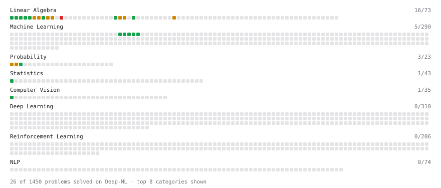

# Deep-ML

My machine learning practice from [Deep-ML](https://www.deep-ml.com). Every solution here was written by hand.

**26** solved · 26 problems · 0 labs · 0 math

[**Browse the interactive portfolio**](https://AbhishekTK.github.io/deep-ml/) to replay this filling in over time.

## Problems

| | Difficulty | Solved | |
| --- | --- | --- | --- |
| [Calculate 2x2 Matrix Inverse](https://www.deep-ml.com/problems/8) | easy | 2025-06-03 | [solution](problems/0008-calculate-2x2-matrix-inverse) |
| [Calculate Covariance Matrix](https://www.deep-ml.com/problems/10) | easy | 2025-06-16 | [solution](problems/0010-calculate-covariance-matrix) |
| [Calculate Dice Score for Classification](https://www.deep-ml.com/problems/73) | easy | 2026-09-22 | [solution](problems/0073-calculate-dice-score-for-classification) |
| [Calculate Image Brightness](https://www.deep-ml.com/problems/70) | easy | 2026-09-20 | [solution](problems/0070-calculate-image-brightness) |
| [Calculate Jaccard Index for Binary Classification](https://www.deep-ml.com/problems/72) | easy | 2026-09-21 | [solution](problems/0072-calculate-jaccard-index-for-binary-classification) |
| [Calculate Mean by Row or Column](https://www.deep-ml.com/problems/4) | easy | 2025-05-30 | [solution](problems/0004-calculate-mean-by-row-or-column) |
| [Calculate R-squared for Regression Analysis](https://www.deep-ml.com/problems/69) | easy | 2026-09-18 | [solution](problems/0069-calculate-r-squared-for-regression-analysis) |
| [Calculate Root Mean Square Error (RMSE)](https://www.deep-ml.com/problems/71) | easy | 2026-09-21 | [solution](problems/0071-calculate-root-mean-square-error-rmse) |
| [Dot Product Calculator](https://www.deep-ml.com/problems/83) | easy | 2026-01-17 | [solution](problems/0083-dot-product-calculator) |
| [Generate a Confusion Matrix for Binary Classification](https://www.deep-ml.com/problems/75) | easy | 2026-09-23 | [solution](problems/0075-generate-a-confusion-matrix-for-binary-classification) |
| [Implement Compressed Column Sparse Matrix Format (CSC)](https://www.deep-ml.com/problems/67) | easy | 2026-09-18 | [solution](problems/0067-implement-compressed-column-sparse-matrix-format-csc) |
| [Matrix-Vector Dot Product](https://www.deep-ml.com/problems/1) | easy | 2025-04-29 | [solution](problems/0001-matrix-vector-dot-product) |
| [Poisson Distribution Probability Calculator](https://www.deep-ml.com/problems/81) | easy | 2026-09-26 | [solution](problems/0081-poisson-distribution-probability-calculator) |
| [Reshape Matrix](https://www.deep-ml.com/problems/3) | easy | 2025-05-29 | [solution](problems/0003-reshape-matrix) |
| [Scalar Multiplication of a Matrix](https://www.deep-ml.com/problems/5) | easy | 2025-06-02 | [solution](problems/0005-scalar-multiplication-of-a-matrix) |
| [Transpose of a Matrix](https://www.deep-ml.com/problems/2) | easy | 2025-05-09 | [solution](problems/0002-transpose-of-a-matrix) |
| [Binomial Distribution Probability](https://www.deep-ml.com/problems/79) | medium | 2026-09-24 | [solution](problems/0079-binomial-distribution-probability) |
| [Calculate Eigenvalues of a Matrix](https://www.deep-ml.com/problems/6) | medium | 2025-06-02 | [solution](problems/0006-calculate-eigenvalues-of-a-matrix) |
| [Create Composite Hypervector for a Dataset Row](https://www.deep-ml.com/problems/74) | medium | 2026-09-23 | [solution](problems/0074-create-composite-hypervector-for-a-dataset-row) |
| [Find the column space of a matrix](https://www.deep-ml.com/problems/68) | medium | 2026-09-18 | [solution](problems/0068-find-the-column-space-of-a-matrix) |
| [Matrix Rank](https://www.deep-ml.com/problems/329) | medium | 2026-09-18 | [solution](problems/0329-matrix-rank) |
| [Matrix times Matrix ](https://www.deep-ml.com/problems/9) | medium | 2025-06-05 | [solution](problems/0009-matrix-times-matrix) |
| [Matrix Transformation ](https://www.deep-ml.com/problems/7) | medium | 2025-06-03 | [solution](problems/0007-matrix-transformation) |
| [Normal Distribution PDF Calculator](https://www.deep-ml.com/problems/80) | medium | 2026-09-25 | [solution](problems/0080-normal-distribution-pdf-calculator) |
| [Solve Linear Equations using Jacobi Method](https://www.deep-ml.com/problems/11) | medium | 2025-06-17 | [solution](problems/0011-solve-linear-equations-using-jacobi-method) |
| [Determinant of a 4x4 Matrix using Laplace's Expansion (hard)](https://www.deep-ml.com/problems/13) | hard | 2026-01-17 | [solution](problems/0013-determinant-of-a-4x4-matrix-using-laplace-s-expansion-hard) |

---

_This file is regenerated by Deep-ML on every push._
